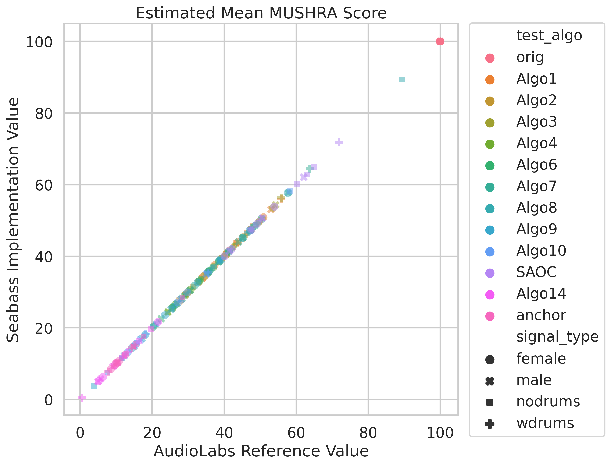
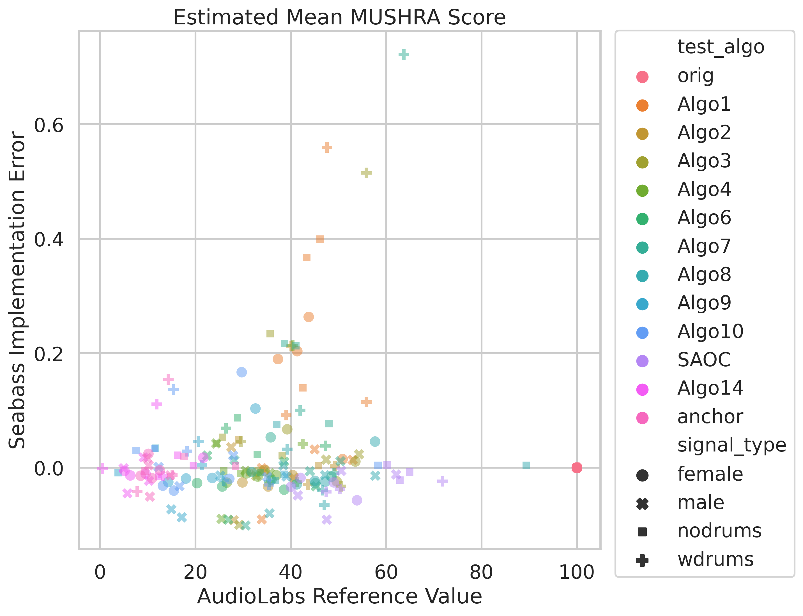
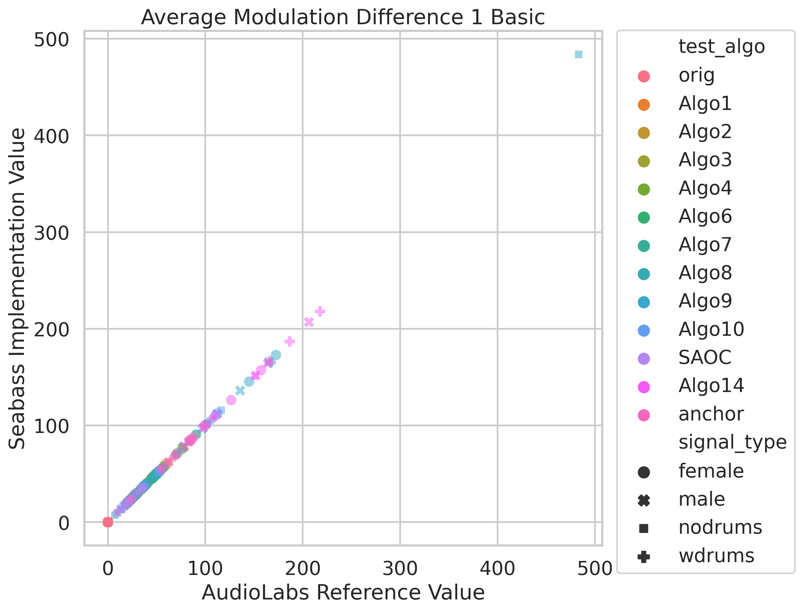
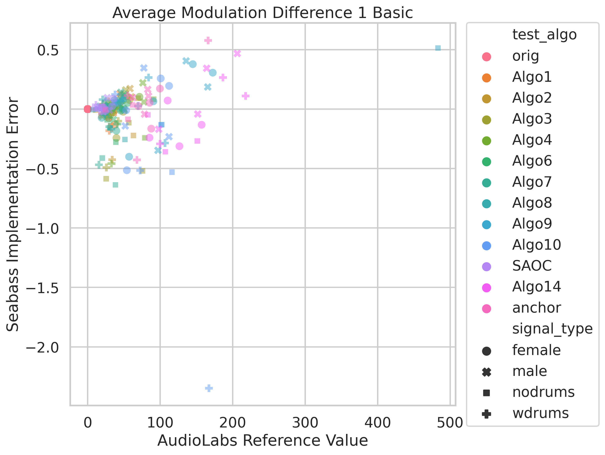
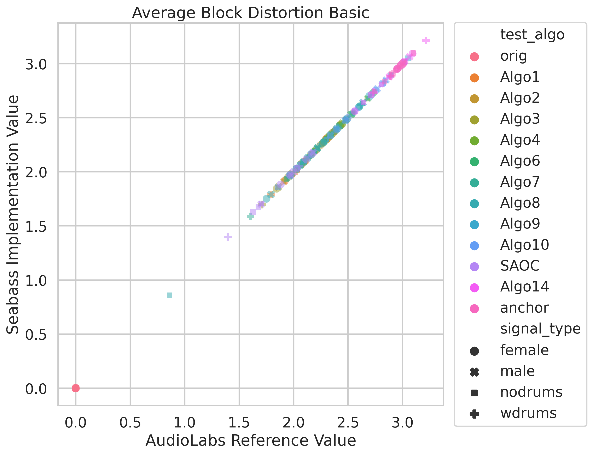
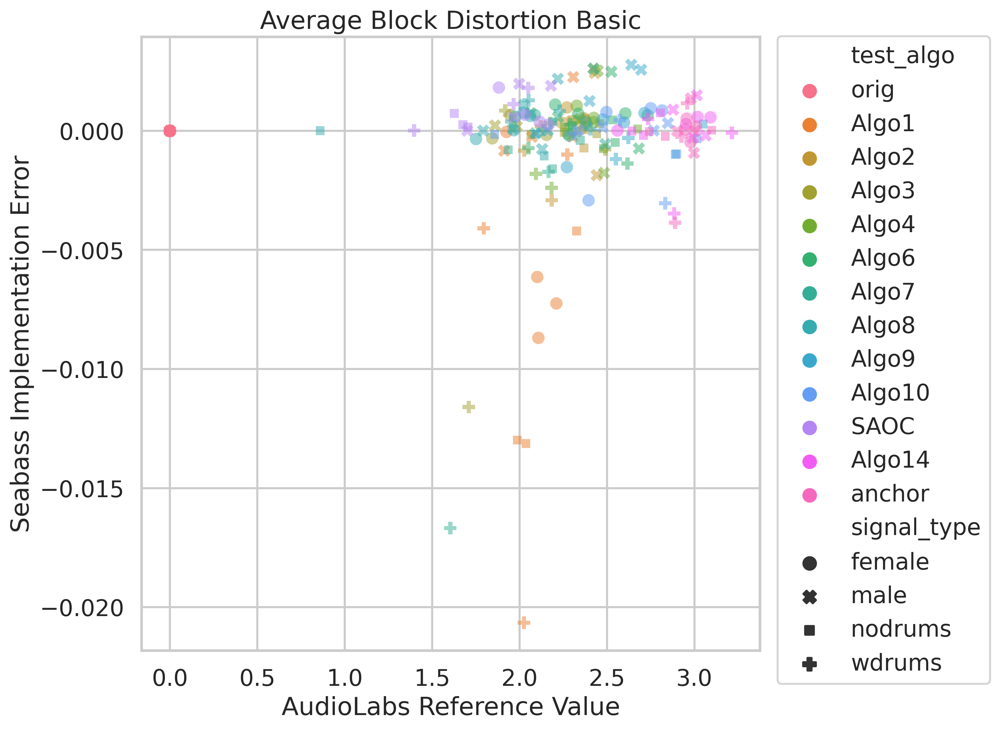

# Validation

As with many scientific software ports, getting the outputs to match the original exactly is difficult, 
but we have done our best to ensure that the outputs are as close as possible. 
The reference data we used can be found under the `tests` folder or from the AudioLabs website [here](https://www.audiolabs-erlangen.de/resources/2019-WASPAA-SEBASS).)

The correlations between the original and our implementation are as follows:

| Variable                              |   MA%E |    MAE |       MSE |   Pearson |   Spearman |
|---------------------------------------|--------|--------|-----------|-----------|------------|
| Average Block Distortion Basic        |  0.058 | 0.0012 | 0.0000086 |  0.999992 |    0.99993 |
| Average Modulation Difference 1 Basic |  0.256 | 0.1375 | 0.0677427 |  0.999989 |    0.99993 |
| Estimated Mean MUSHRA Score           |  0.171 | 0.0520 | 0.0116240 |  0.999990 |    0.99996 |

## Estimated Mean MUSHRA Score

  
  

## Model Output Variables

### Average Modulation Difference 1 Basic

  
  

### Average Block Distortion Basic

  
  

